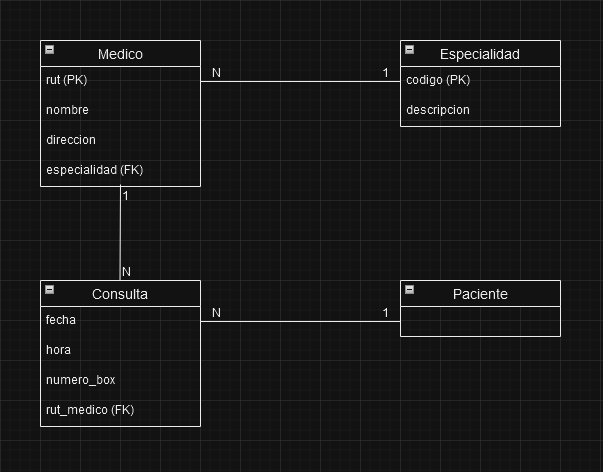
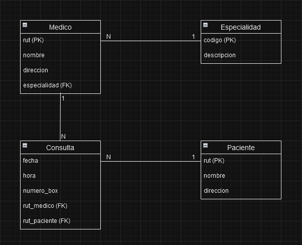
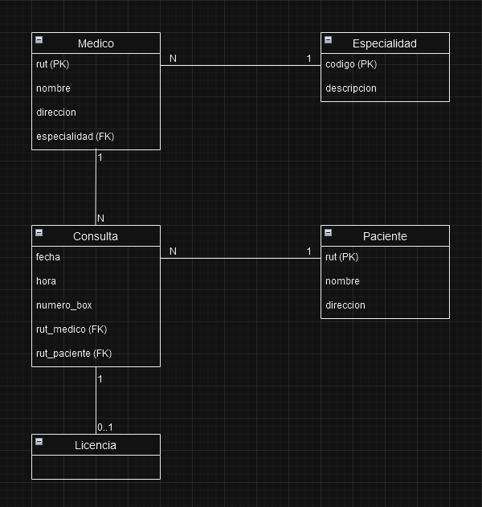
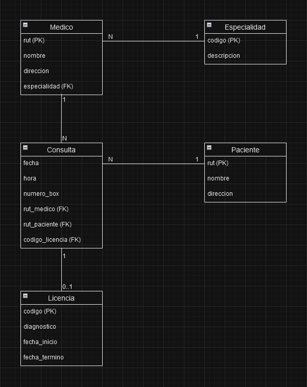

# Desafío - Modelos Entidad-Relación y Relacional

### Josué Gallardo - Bootcamp Talendo Digital - Desafío Latam

## Requerimientos

1. La consulta tiene una fecha, hora de atención y número de box (consultorio).

   

2. El paciente tiene un nombre, rut y dirección.

   

3. Un médico puede o no entregar una licencia a un paciente.

   

4. La licencia tiene un código, un diagnóstico, una fecha de inicio y una fecha de
   término.

   
